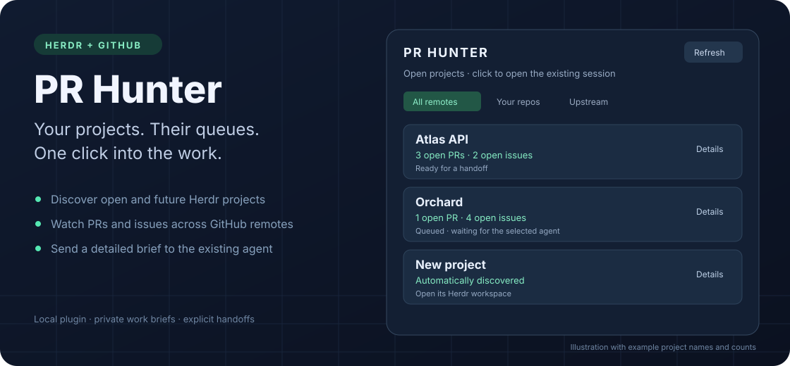
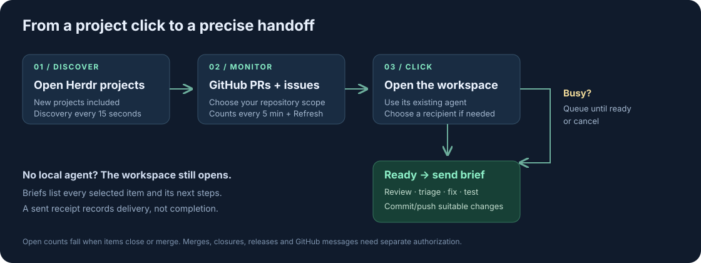

# PR Hunter



An Omarchy menu-bar plugin that watches GitHub PRs and issues for projects open
in Herdr. Click a project to focus its **existing** agent session and send it a
detailed work brief. It supports Claude, Codex and other agents recognized by
Herdr. It never launches replacement agents.



## Use

- Click the Git branch icon and project count in the bar.
- Click any project row to open its existing Herdr workspace. With one local
  agent and a mapped repository, the click also assigns new/updated items.
  Other rows still open the workspace; use Details to choose an agent or mapping.
- If a terminal is already attached, it is focused. Otherwise the plugin opens
  your default terminal attached to the same running Herdr session.
- **All remotes / Your repos / Upstream** chooses the queue sent by a click.
  “Your repos” means repositories owned by the account authenticated in `gh`.
- Counts are **open GitHub items**, not unfinished agent tasks. They fall when
  PRs/issues close or merge, within five minutes or when you press Refresh.
  The bar badge counts projects with open items across all remotes.
  **Last handoff** is a historical receipt and does not shrink as items close.
- **Details** shows each repository, counts, agent choices, the last handoff,
  and a **Preview brief** action. Preview fetches all open items without sending.
- **Open session** focuses the session without assigning work.
- A busy, blocked or unknown agent receives a queued handoff only after it is
  ready. **Cancel queue** cancels a pending handoff. Queues expire after 24 hours.
- If multiple agents occupy a project, select one in Details before sending.
- Projects without a GitHub checkout remain visible. **Save mapping** associates
  a project with its actual local checkout when its terminal started elsewhere.

The brief lists repository paths/remotes and every selected issue/PR number,
title, URL, update time and draft status. It directs the agent to read discussions,
review diffs and CI, reproduce problems, group duplicates, implement suitable
fixes, run checks, commit/push to the intended user repository and report an
outcome for every item. Upstream changes are assessed for the user's fork.
Merging, closing items, deployments, releases and GitHub comments/reviews need
separate user authorization. GitHub content is explicitly untrusted evidence.

## Install

Requires Linux, Omarchy's plugin-capable shell, Herdr 0.8.2 (socket protocol 20),
Python 3.10+, Git, `xdg-terminal-exec` and an authenticated GitHub CLI (`gh auth status`). No Python
packages, access tokens in settings, web server or separate system service.

```sh
git clone https://github.com/nixfred/pr.hunter.git
cd pr.hunter
python3 install.py
```

The installer links this checkout into `~/.config/omarchy/plugins/nixfred.pr-hunter`
and adds one visible bar entry. It uses a **fresh live** configuration snapshot
and a compare-and-set update, retaining all other entries and their order.
Keep the checkout in place. Python changes are picked up on the next scan.
After QML edits, rescan with `omarchy-shell shell rescanPlugins`; shell builds
that retain QML's component cache may require a shell reload for same-file edits.

Disable without removing code or state:

```sh
omarchy plugin disable nixfred.pr-hunter
```

Disabling stops the background scanner and queue delivery. Re-enable with
`python3 install.py`. Pending queues resume if still valid; cancel them first
if you do not want them resumed.

## Discovery and storage

Every 15 seconds the plugin discovers all **running local named Herdr sessions**,
then reads their live workspace/pane/agent snapshots. New projects are included
automatically. It resolves Git roots from the panes' directories and de-duplicates
GitHub fetch remotes. GitHub counts are cached for five minutes, with manual
Refresh and a one-minute retry after errors. Errors remain visible; old counts
are not silently replaced with zero. Clicks and previews fetch complete,
paginated open-item lists. Partial repository failures are reported in the UI
and brief; only successfully fetched items are assigned. A failed Herdr discovery
pauses affected handoffs instead of treating a missing snapshot as a closed project.
GitHub ownership is rechecked for handoffs and refreshed at least every five minutes.
Draft PRs are included but the brief makes them review-only.

All projects are visible, including unmapped projects and ordinary terminals.
An SSH/tmux session without a locally detected Herdr agent (for example a remote
shell inside a pane) can be focused but is not prompted. Run Herdr and this
integration on the remote machine, or use a supported local agent, to enable
that handoff. Arbitrary remote shells are never treated as agent input boxes.

Machine-specific mappings live in `~/.config/pr-hunter/config.json`, keyed by
`session-name:workspace-label`:

```json
{
  "mappings": {
    "default:My Project": {"paths": ["/absolute/path/to/checkout"]}
  }
}
```

Multiple paths can be set in this file when a space covers several repositories.
Paths are read as data, not shell commands. Automatic discovery needs no mapping.
Renaming a manually mapped space requires saving the mapping under its new name.

Private snapshots, cached GitHub counts, dispatch receipts and Markdown briefs
live in `~/.local/state/pr-hunter/` (respects XDG overrides). These files are never
committed to this repository. Queues are pinned to pane, terminal and agent-session
identity and cancelled if the project closes, its repository mapping changes or
the agent is replaced. The same item version is not dispatched twice, even across
multiple open worktrees. Updated items are eligible again when explicitly clicked.

Delivery receipts are written before sending. An ambiguous transport failure is
shown as uncertain and **never automatically retried**. Inspect that session, then use **Acknowledge receipt** to unblock new work.
Acknowledgment keeps the recorded item versions protected against duplicate
submission. It does not retry them or claim that the work completed.
“Sent” means the prompt was accepted, not that the agent completed the work.

Window focus uses the Herdr client's actual terminal process ancestry and its
named session, not a guessed terminal title. When no attached window is found, it launches `herdr session attach` in the
default terminal. It uses the already-running server and never starts a new agent.
If the compositor or terminal launcher is unavailable, it reports the focus limitation.

## Verification and command line

```sh
python3 -m unittest discover -s tests -v
python3 tests/check_qml.py    # real QML + fake helper, requires Quickshell
python3 tests/check_herdr.py  # temporary Herdr server + harmless input recorder; requires cc
omarchy plugin validate .
python3 pr_hunter.py scan
omarchy-shell nixfred.pr-hunter status
omarchy-shell nixfred.pr-hunter open
```

`scan` returns project keys. `preview --key KEY` prints the complete brief;
`focus --key KEY` opens a session; `dispatch --key KEY --scope mine --pane PANE`
assigns work; `cancel --key KEY` cancels queued work. Unlike preview, `scan` also
services previously authorized queues. No work is assigned merely by installation.

References: [Herdr socket API](https://herdr.dev/docs/socket-api/),
[GitHub issue listing (includes pull requests)](https://docs.github.com/en/rest/issues/issues#list-repository-issues).

## Audit

Version 1.0.1 includes a [Grok audit and finding-by-finding resolution](docs/audits/2026-09-09.md),
41 Python regression tests, an isolated native Herdr transport check, and an
actual QML service test. Both README graphics are original SVG illustrations
with example names and counts, not screenshots of private sessions.

Herdr protocol 20 has no atomic “submit only to this occupant if still idle”
parameter. PR Hunter checks identity and readiness immediately before prompting,
but a replacement or state change in the small gap between those RPCs remains
an upstream protocol limitation. Delivery records favor avoiding duplicate input.
Briefs and deduplication records are retained locally; do not delete a brief while
an agent may still need it. They are never included in the public repository.
